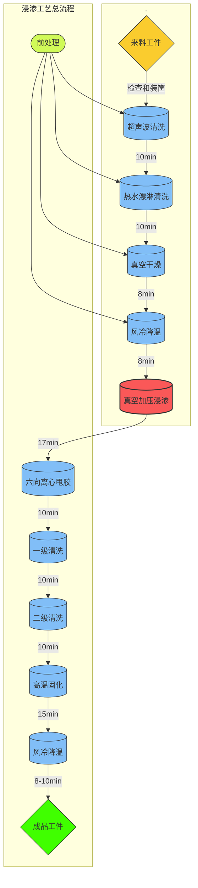

 **南京艾布纳密封技术股份有限公司宁波锢实浸渗加工生产线**

  采用艾布纳密封真空压力浸渗系统（10工位流程）循环回收有机浸渗剂，真空加压浸渗工艺，可以为**汽车零部件制造商、压力元器件制造商、粉末冶金零件生产商、气密阀体生产商、表面处理行业**客户提供浸渗加工服务。

- 超声波+热水旋转喷淋清洗、解决客户前期清洗工序问题,浸渗后的工件表面清洁度高
- PLC控制，生产稳定
- 标准化操作，无磕碰，质量可靠
- 配合使用循环回收有机浸渗液，减排环保
- 工件无残胶、无水痕、不变色、可耐受温度高

  浸渗(impregnation)又叫含浸、渗透，是工业生产中常见的一种技术，尤其是在汽车领域中的应用更是广泛。作为一种处理气孔的方法而被广泛使用，在微孔密封技术领域相对于5mm铸件壁厚，通常将直径在0.254mm以下的孔称之为微孔，这些孔通常用肉眼是难以发现的。带来生产成本的增加，使产品的质量难以取得保证。在汽车动力系统及气动液压系统铸件中，微孔的存在将导致被密封介质的浸漏，增加机加工刀具的磨损，同时产品的使用过程中，令其丧失应有的功能。

浸渗的原理：通过真空压力浸渗设备将其浸渗剂充分渗入工件微孔中，填充微孔间隙，有效的防止了工件的泄漏以及腐蚀，从而达到密封补漏的目的。

浸渗范围: 适用锌合金、铜合金、铝合金、铸铁件、铸钢件等漏气漏油的浸渗。典型的浸渗件如发动机缸体、缸盖、进气歧管、油泵、油嘴、水泵、阀盖、铸造油底壳、化油器壳体、变速箱壳体、曲轴箱、压缩机、ABS控制器、动力转向器、汽车轮毂、燃料泵、天然气控制阀、液压阀、玲却泵、密封的飞机仪器、及电子仪器护罩、气制动零件和各种气体仪表等。这些铸件经过浸渗剂注入微孔被持久的密封，其承压能力达到铸件的破裂强度。

我们用优异的技术，优良的服务满足客户的需求，秉着以为客户创造价值的宗旨，诚邀相关厂商洽谈合作。

------

【南京艾布纳密封技术股份有限公司】
地址：江苏省南京市溧水区经济开发区前进路10号
网址：www.abnen.com
电话：025-57422333    57422444
传真：025-57422555    56619007

【宁波锢实浸渗加工有限公司】
地址：宁波市北仑区大碶璎珞188号2幢1号
邮编：315806 
电话：18519195469   
邮箱：gsjsjg@wo.cn   

